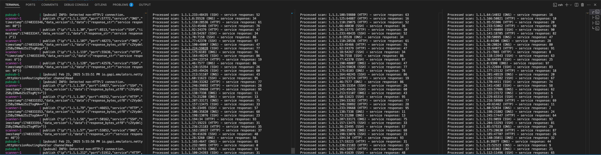

# Table of content
- [Mini-Scan Project](#mini-scan-project)
- [Setup](#setup)
- [Development](#development)
- [Results](#results) 
- [Some Experiments](#some-experiments) 
- [Other Considerations](#other-considerations)

## Mini-Scan Project

As you've heard by now, We scans the internet at an incredible scale. Processing the results necessitates scaling horizontally across thousands of machines. One key aspect of our architecture is the use of distributed queues to pass data between machines.

## Setup
After understanding the README and went through the existing code in the repo, I know there will be a google pubsub emulator running in Docker, setup the topic and publish the scan result the topic.

I supposed to write a program to consume the data coming out of the topic. I added few logs in the `scanner/main.go` to make it easier to debug. Now I saw the pubsub message are published:
```
pubsub-1   | [pubsub] Feb 23, 2025 8:08:43 AM io.gapi.emulators.netty.HttpVersionRoutingHandler channelRead
pubsub-1   | [pubsub] INFO: Detected non-HTTP/2 connection.
scanner-1  | publish {"ip":"1.1.1.218","port":11095,"service":"HTTP","timestamp":1740298123,"data_version":2,"data":{"response_str":"service response: 52"}}
scanner-1  | publish {"ip":"1.1.1.14","port":59331,"service":"SSH","timestamp":1740298124,"data_version":2,"data":{"response_str":"service response: 28"}}
scanner-1  | publish {"ip":"1.1.1.223","port":21705,"service":"SSH","timestamp":1740298125,"data_version":1,"data":{"response_bytes_utf8":"c2VydmljZSByZXNwb25zZTogMTI="}}
scanner-1  | publish {"ip":"1.1.1.99","port":22249,"service":"HTTP","timestamp":1740298126,"data_version":1,"data":{"response_bytes_utf8":"c2VydmljZSByZXNwb25zZTogNA=="}}
scanner-1  | publish {"ip":"1.1.1.43","port":43349,"service":"SSH","timestamp":1740298127,"data_version":1,"data":{"response_bytes_utf8":"c2VydmljZSByZXNwb25zZTogMzY="}}
```

## Development
Please refer to `cmd/subscriber/main.go` for the implementation details.
Some implementation highlights:
- Used SqlLite as a simple storage, using Primary key of (ip, port, service) to ensure the uniqueness. Also use `Insert OR Replace` statement to keep the last scanned.
- Maintained a clean structure by putting logic in functions with clear comments.
- Added a simple unit-test code.
- Integration tests were done manually.

## Results
I have tested with difference numbers of subscribers and I am able to get the expected results.
### 1 subscriber
I see the published message got properly consumed and processed by the subscriber.

### 2 subscribers
I see the published message got properly consumed and processed by both subscribers.

### 3 subscribers
I see the published message got properly consumed and processed by all three subscribers.

- If all subscribers have the same subscription name, only one subscriber will receive a copy of message.
- If each subscriber has an unique subscription name, all subscribers will receive a copy of the message.



### Some Experiments
The incoming message is published at 1 second per second rate which is very low, I am interested in the performance of the pubsub emulator. So I tried to change the message producing rate a 1 millisecond, which is 1000 messages / second. I am able to see the system holds up properly even with 1 subscriber. Rough estimate of each subscriber can process ~150 messages per second, with 3 subscribers, 3 x 150 = ~450 messages can be processed per second. However, if the producer rate is higher than the consumer, eventually the emulated PubSub will run out of memory due to the continuously increasing number of messages, which will cause the container to terminated.  
```
$docker stats
93c8080d2d7f   mini-scan-system-pubsub-1
3.28%     1.032GiB / 15.66GiB   6.59%     31.6MB / 21.3MB   236MB / 15.7MB    67
```

If we want to maintain the similar rate between subscribers and producer, we will need 8 subscribers.

## Other Considerations
- Security: we only want to certain parties to be able to access the PubSub subscriptions. we can use Identity and Access Management (IAM) to set fine-grained access controls. Here are the key steps to restrict subscription access
Reference: [PubSub Access control with IAM](https://cloud.google.com/pubsub/docs/access-control)
- Cost:For Google Cloud Pub/Sub with a huge number of messages and topics, the cost can be significant. As we can see in the pricing table, the price may be a concern if the incoming data volume is too large.
Reference: [Pub/Sub pricing](https://cloud.google.com/pubsub/pricing)

	For a system processing 10,000 log records per second, with each record being about 5 KB in size, this translates to approximately 4 TB of data per day, the estimated cost is around $4,500 per month for Pub/Sub alone [Reference](https://www.macrometa.com/event-stream-processing/google-pubsub).

	Several things to consider to reduce cost:
	1. Micro-batching: Combine records into files stored on Google Storage and publish file paths to Pub/Sub. This can reduce costs but may introduce processing delays8.
	2. Utilize the free tier: The first 10 GB of data per month is offered at no charge35.
	3. Consider Pub/Sub Lite: For high-volume messaging with lower costs, but with zonal limitations

- Create a dead-letter topic for messages that cannot be successfully delivered or processed. 
- Google cloud pubsub supports [exact-once delivery](https://cloud.google.com/pubsub/docs/exactly-once-delivery)
[code snippet](https://github.com/GoogleCloudPlatform/golang-samples/blob/66716d85a55616601c8a0b634885505f7a439a49/pubsub/subscriptions/pull_exactly_once_delivery.go#L55)
```go
// or msg.NackWithResult() instead of the regular Ack/Nack methods.
// When exactly once delivery is enabled on the subscription, the message is
// guaranteed to not be delivered again if the ack result succeeds.
	err = sub.Receive(ctx, func(ctx context.Context, msg *pubsub.Message) {
		fmt.Fprintf(w, "Got message: %q\n", string(msg.Data))
		r := msg.AckWithResult()
		// Block until the result is returned and a pubsub.AcknowledgeStatus
		// is returned for the acked message.
		status, err := r.Get(ctx)
		if err != nil {
			fmt.Fprintf(w, "MessageID: %s failed when calling result.Get: %v", msg.ID, err)
		}

		switch status {
		case pubsub.AcknowledgeStatusSuccess:
			fmt.Fprintf(w, "Message successfully acked: %s", msg.ID)
		case pubsub.AcknowledgeStatusInvalidAckID:
			fmt.Fprintf(w, "Message failed to ack with response of Invalid. ID: %s", msg.ID)
		case pubsub.AcknowledgeStatusPermissionDenied:
			fmt.Fprintf(w, "Message failed to ack with response of Permission Denied. ID: %s", msg.ID)
		case pubsub.AcknowledgeStatusFailedPrecondition:
			fmt.Fprintf(w, "Message failed to ack with response of Failed Precondition. ID: %s", msg.ID)
		case pubsub.AcknowledgeStatusOther:
			fmt.Fprintf(w, "Message failed to ack with response of Other. ID: %s", msg.ID)
		default:
		}
	})
```

- Google pubsub support both pull and push subscription.
- Google pubsub support both topic-level and subscription-level ack.

--- 

# Instruction 

The `docker-compose.yml` file sets up a toy example of a scanner. It spins up a Google Pub/Sub emulator, creates a topic and subscription, and publishes scan results to the topic. It can be run via `docker compose up`.

Your job is to build the data processing side. It should:
1. Pull scan results from the subscription `scan-sub`.
2. Maintain an up-to-date record of each unique `(ip, port, service)`. This should contain when the service was last scanned and a string containing the service's response.

> **_NOTE_**
The scanner can publish data in two formats, shown below. In both of the following examples, the service response should be stored as: `"hello world"`.
> ```javascript
> {
>   // ...
>   "data_version": 1,
>   "data": {
>     "response_bytes_utf8": "aGVsbG8gd29ybGQ="
>   }
> }
>
> {
>   // ...
>   "data_version": 2,
>   "data": {
>     "response_str": "hello world"
>   }
> }
> ```

Your processing application should be able to be scaled horizontally, but this isn't something you need to actually do. The processing application should use `at-least-once` semantics where ever applicable.

You may write this in any languages you choose, but Go, Scala, or Rust would be preferred. You may use any data store of your choosing, with `sqlite` being one example.
